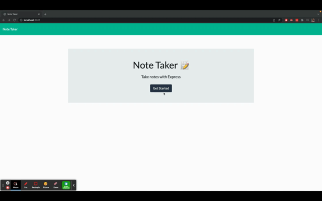

# Express Note Taker
This application lets users add, save, and delete notes they make on the front-end. It uses express.js, node.js, and the npm package uniqid to generate an id for each note.

The application is deployed and useable on Heroku: [Note Taker App](https://git.heroku.com/mysterious-bastion-21980.git)

The repository for the app is available on my github: [Note Taker Git Repository](https://github.com/Iviviana/Note-Taker-App)

## Installation

Clone the repository to your device.

```
git clone https://github.com/Iviviana/Note-Taker-App.git
```
Run ``npm install`` to install all required dependencies. To use the app locally, run ``npm start`` on your terminal and open to your local host:

```
http://localhost:3001
```
Your local host may differ from the one above, just change the last four digits to whatever your host is.




[Link to a video that shows how to use the application.](https://watch.screencastify.com/v/czLx6axQLetnIXDWJeEl)

## Contributions

* [JavaScript](https://www.javascript.com/)
* [NodeJS](https://nodejs.org/en/)
* Node packages:
    * [Express.js](https://expressjs.com/)
    * [Uniqid](https://www.npmjs.com/package/uniqid)

## License


